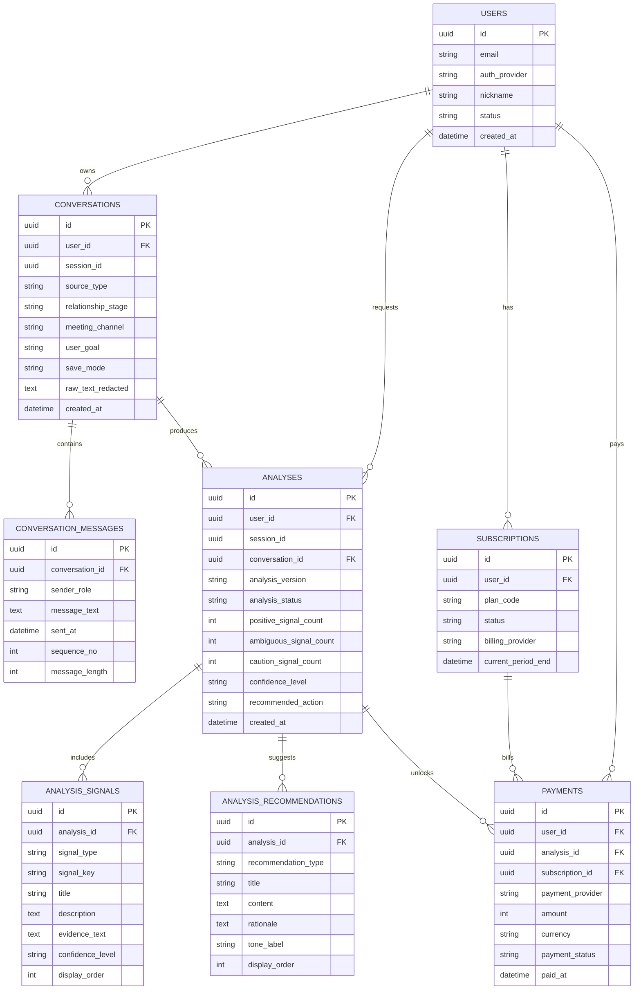

# SignalMate ERD

작성일: 2026-03-27

## 1. 목적

이 문서는 SignalMate MVP의 핵심 데이터 구조를 시각적으로 정리한 ERD다.

초기 버전에서는 아래 흐름이 자연스럽게 이어지도록 설계한다.

- 사용자가 대화를 업로드한다
- 대화가 메시지 단위로 파싱된다
- 분석 실행이 생성된다
- 신호 카드와 추천 메시지가 결과로 생성된다
- 필요하면 결제, 구독, 대기자 등록까지 연결된다

## 2. ERD

## 3. 해석 포인트

- `conversations`와 `analyses`를 분리해서 같은 대화를 여러 엔진 버전으로 재분석할 수 있게 한다.
- `analysis_signals`와 `analysis_recommendations`를 분리해서 결과 화면과 추천 메시지 화면을 독립적으로 구성한다.
- `session_id`를 두어 비회원 체험 분석도 지원할 수 있게 한다.
- `payments`는 단건 분석 결제와 구독 결제를 모두 연결할 수 있게 설계한다.

## 4. MVP 메모

- 초기에는 `waitlist_signups`를 별도 마케팅 테이블로 운영할 수 있다.
- 저장 없는 분석은 `save_mode=temporary`와 TTL 삭제 정책으로 처리한다.
- `raw_text_redacted`만 보관하고 원문 저장 여부는 별도 정책으로 통제한다.
